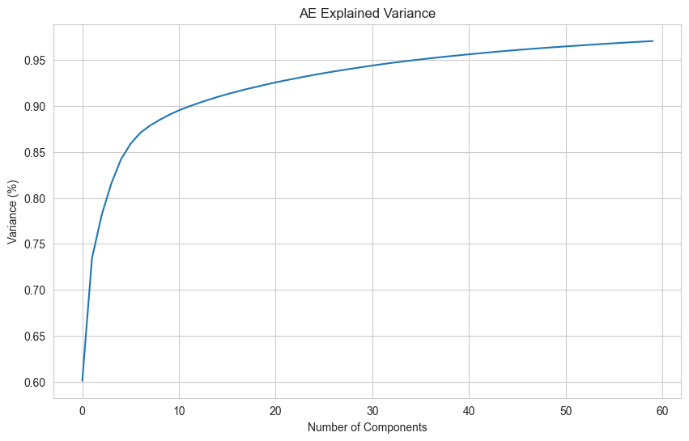
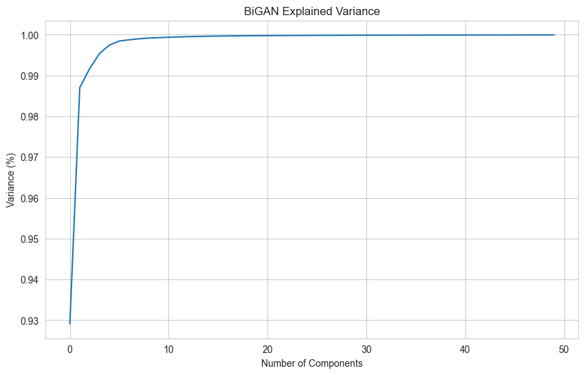
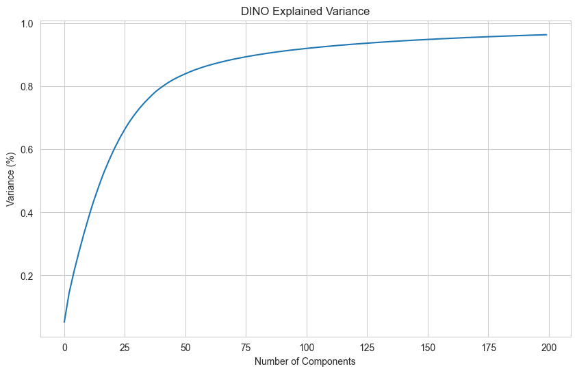
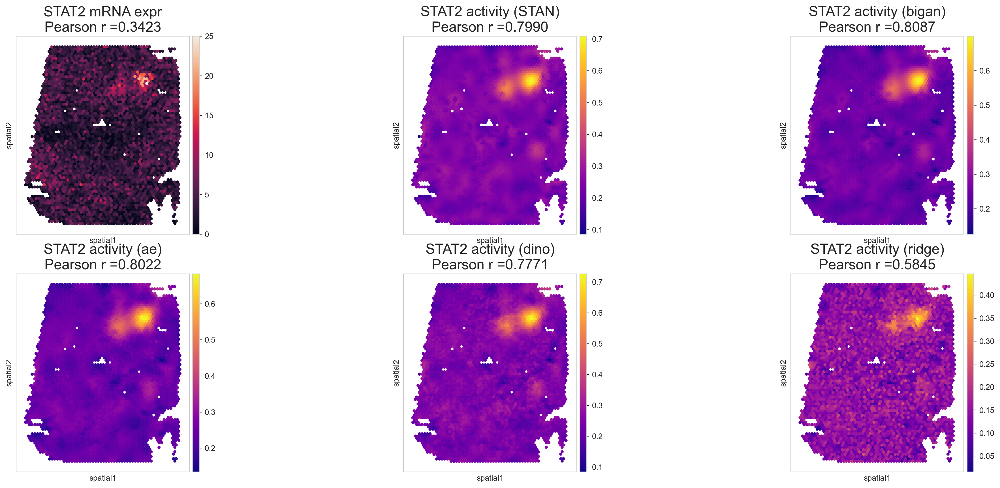
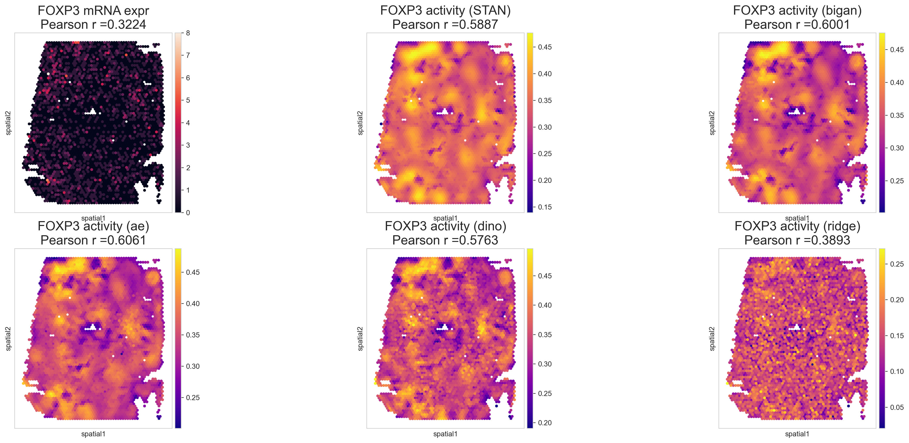

# STAN_plus

10.28.2024 Update:

* Removed the filtering of the spots on the tissue. 
* Updated the make_kernel function -- remove the RGB values from the kernel.
* Streamlined the process in d_analysis notebook.
* Updated the related resources.

### Introduction

Using the img_feature of the tissue image as a new feature to the STAN, hoping to improve the performance of the STAN model.

To run the code, you should install the required packages by running the following command in the terminal:
```angular2html
pip install -r requirements.txt
```
As the onedrive does not take files with specific file_names, the adata was uploaded to the OnDemand server. So, before running the code, You should also download the adata from the OnDemand server, the path is as follows:
```angular2html
/ihome/hosmanbeyoglu/haw309/stan_plus/new_stan/results/V1_Human_Lymph_Node26*26.h5ad
```

You should follow the sequence of the following steps to run the notebook.

* stan_IMG.ipynb
* stan_plus_noT.ipynb
* d_analysis.ipynb

### 1. Extracting the patches from the tissue image.

For each spot, we extract a patch (26*26) of the tissue image centered at the spot if it is on the tissue.

~~We firstly extract the contours of the tissue, and then we can determine whether the spot is on the tissue by checking whether the spot is in the contours.~~

### 2. Extracting the img_feature from the patches.
We use 3 models to extract the img_feature from the patches, including the Autoencoder, BiGAN, and Dino.

* For the Autoencoder and BiGAN, we use the encoder part to extract the img_feature. Before extracting the img_feature, we need to train the model with the patches, which is a self-supervised learning task.

* For the Dino, we use the pre-trained model to finetune the patches. The Dino model is a self-supervised learning model, which can be used to extract the img_feature directly.

### 3. Adding the img_feature to the STAN model.
First, we need to do PCA on the img_feature to reduce the dimension of the img_feature.
We added 30, 10, 50 PCs of the img_feature to the STAN model, respectively.

<div style="display: flex; justify-content: space-between;">
  
  
  
</div>


```angular2html

Adding the img_feature PCs as a new feature to the kernel.
```angular2html
def  make_kernel_img(adata,f_name, n=100,kernel_name = '', bandwidth=1, im_feats_weight=0.3):
    X = np.concatenate((adata.obsm['spatial'][:, 0:2], adata.obsm['pixel'], adata.obsm[f_name]), axis=1)
```

### 4. Results
We evaluate the performance of the origin STAN model and the STAN model with the img_feature added, shown as below. 






