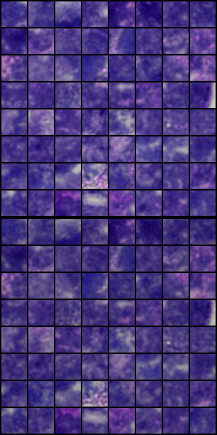

# STAN_plus

11.16.2024 Update:
* Updated new methods to extract the img_feature from the patches.
* Removed the STAN in this repository (in the Lab's repository).
* Only kept the BiGAN pipeline in this repository.
* Updated the Readme.md, with the new pipeline and the new results.

10.28.2024 Update:

* Removed the filtering of the spots on the tissue. 
* Updated the make_kernel function -- remove the RGB values from the kernel.
* Streamlined the process in d_analysis notebook.
* Updated the related resources.

### Introduction

In current omics data research, feature extraction from tissue images has become an important step. 

In Spatial Transcriptomics, the image representation of each point provides new information for quantifying transcription factors or signaling pathways.

Here we tried to extract the representation of the tissue image by using the BiGAN model, and then added the representation to the downstream analysis model, STAN.

We use the BiGAN model to **reconstruct larger images from smaller patches**, which can force both the encoder and decoder to learn the potential representation of the tissue image.

To run the code, you should install the required packages by running the following command in the terminal:
```angular2html
pip install -r requirements.txt
```

### 1. Extracting the patches from the tissue image.

For each spot, we extract a patch (36 * 36) of the tissue image centered at the spot if it is on the tissue.

~~We firstly extract the contours of the tissue, and then we can determine whether the spot is on the tissue by checking whether the spot is in the contours.~~

### 2. Unsupervised learning to extract the img_feature from the patches.

We use BiGAN to extract the representations from the patches of tissue image.


While training the BiGAN model, we crop the patches from the tissue image into 26 * 26 as the input of the encoder. In addition, we use the decoder to reconstruct the intact patches (36 * 36) from the latent space.

The BiGAN model is trained with the patches of the tissue image, and the latent space is the img_feature of the patches.

As a result, here is a comparison of the patches and the reconstructed patches by the BiGAN model. Each image is divided vertically into two parts, with the top part showing the original image and the bottom part showing the reconstructed image.

<div style="display: flex; justify-content: space-between;">
  
  
  
</div>


